<div align="center">


</div>

<h1 align="center">Tracepad</h1>

<p align="center"><strong>Understand it. Build it. Explain it.</strong></p>

<p align="center">
  Learn Python, rehearse interviews, and explain your reasoning<br>
  in one local workspace.
</p>

<p align="center">
  <a href="#start"><strong>Get started</strong></a> ·
  <a href="#see-it-in-action">Feature tour</a> ·
  <a href="#connect-an-ai-assistant">AI setup</a> ·
  <a href="CONTRIBUTING.md">Contribute</a>
</p>

<p align="center">
  <a href="docs/ALPHA_CHECKLIST.md">Early alpha · 0.1.0-alpha.1</a> &nbsp; / &nbsp;
  Node.js 24 &nbsp; / &nbsp;
  <a href="LICENSE">MIT licensed</a>
</p>

[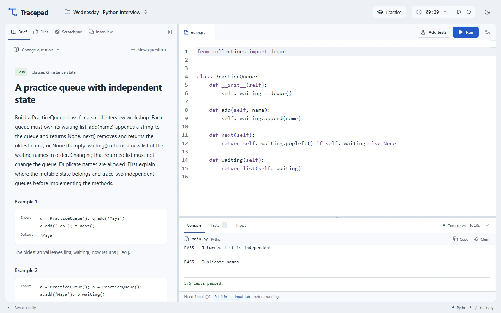](docs/media/workspace-light.png)

<p align="center">
  Code, tests, and visual reasoning side by side.<br>
  <a href="docs/media/workspace-light.png">Light workspace</a> ·
  <a href="docs/media/workspace-dark.png">Dark workspace</a>
</p>

**Local by default.** Python runs in your browser and projects save on your computer. Core practice works offline after installation. Optional AI coaching uses an external MCP-compatible assistant.

**Early alpha.** The rehearsal flow is implemented; exercise quality and the newcomer experience need community feedback. See the [roadmap](docs/COMMUNITY_ROADMAP.md) and [release checklist](docs/ALPHA_CHECKLIST.md).

## Start

You need **Node.js 24**, npm, and a browser. No system Python or separate database installation is required.

```sh
git clone https://github.com/sidkolapalli/TracePad.git
cd TracePad
npm ci
npm run dev
```

Open **[127.0.0.1:5173](http://127.0.0.1:5173/)** and keep the terminal running while you practice. Installation downloads the pinned Python runtime and editor assets; the app serves them locally afterward.

### Run your first Python program

1. Open **Brief → Change question → Blank sandbox**.
2. Enter `print("Hello, Tracepad")` in `main.py`.
3. Select **Run**, or press **Ctrl+Enter** (**Cmd+Enter** on macOS). Wait for the local Python interpreter to load; the output appears in **Console**.

Then choose how you want to practice:

- **Explore freely:** use the blank sandbox, eight algorithm exercises, or your own question and assertion tests. Start the optional timer when you are ready.
- **Strengthen a topic:** open **Practice** for a 15- or 20-minute drill on OOP, collections, or debugging. Local variations use offline templates.
- **Rehearse an interview:** choose **Practice → 60-minute mock interview** for a blank editor, guided stages, and a strict clock with no pause or reset.

[Installation help](docs/DEVELOPMENT.md#installation-notes) · [User guide](docs/WORKSPACE_GUIDE.md) · [Saving & backups](#saving-and-privacy) · [Build & test](#build-and-verify)

## Practice the whole interview

**Clarify → Explain an approach → Code & test → Handle a follow-up → Submit → Review**

A mock validates its reference checks before starting the 60-minute clock. The clock keeps running across refreshes and into overtime. Stage prompts help you pace the session; notes, trace tables, and flowcharts give you room to explain an approach before coding.

The built-in mock delivers a scripted follow-up. Enable live updates to receive requirements from your connected assistant instead. Submission saves your code, tests, reasoning, stage timings, and assistance history for review. Original baseline scores do not evaluate later follow-up requirements; add your own tests for those changes.

[Walk through a complete rehearsal](docs/ALPHA_CHECKLIST.md#first-rehearsal-walkthrough) · [Mock controls and timing](docs/WORKSPACE_GUIDE.md#a-complete-mock-interview)

## Connect an AI assistant

Practice works on its own. To add coaching, open **Practice → AI coach** and copy the generated MCP configuration into your assistant's settings.

Your assistant can inspect the current work, supply a tailored question, respond to a requested hint, add an opted-in requirement, or review a submission. Supplied reference solutions must pass their baseline tests before a question can start. Updates arrive in the interface with attribution and remain part of the practice evidence.

Tracepad does not include a model or an autonomous interviewer. Offline question variations are labelled separately from AI-generated questions. Connecting an assistant shares the exposed practice context with that assistant; its provider's data handling applies.

[MCP setup and protocol](docs/MCP.md) · [Watch a contextual hint · 35s](docs/media/features/contextual-hint.mp4)

## See it in action

Explore all 14 features below, grouped by what you want to do. Each looping preview links to a full video with playback controls and a separate caption file. Prefer less motion? Use the [compact video index](docs/DEMO.md).

[Interview rehearsal](#interview-rehearsal) · [Python workspace](#python-workspace) · [AI coaching](#optional-ai-coaching) · [Projects & saved work](#projects--saved-work)

Recorded with synthetic projects, prepared code, and edited waits. Python execution and MCP exchanges are real; the assistant is external to Tracepad. Complexity notes and trace tables are written by the learner.

### Interview rehearsal

#### Start a timed mock

A strict 60-minute mock starts with a blank editor and no pause or reset. Clarify the contract, explain an approach, then move into implementation with the clock running.

[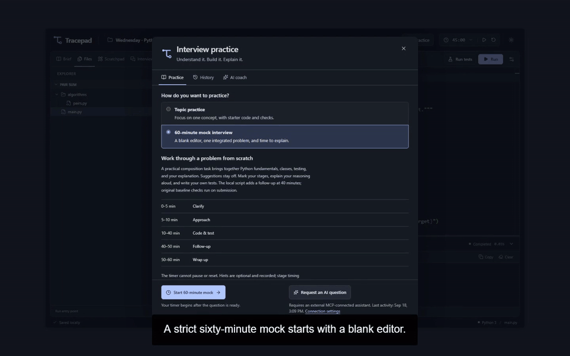](docs/media/features/timed-mock.mp4)

[Watch the full clip · 34s](docs/media/features/timed-mock.mp4) · [Captions](docs/media/features/timed-mock.vtt)

#### Reasoning & complexity notes

Keep assumptions, tradeoffs, and your own time and space complexity analysis with the solution. These notes become part of the evidence you can review or share with a coach.

[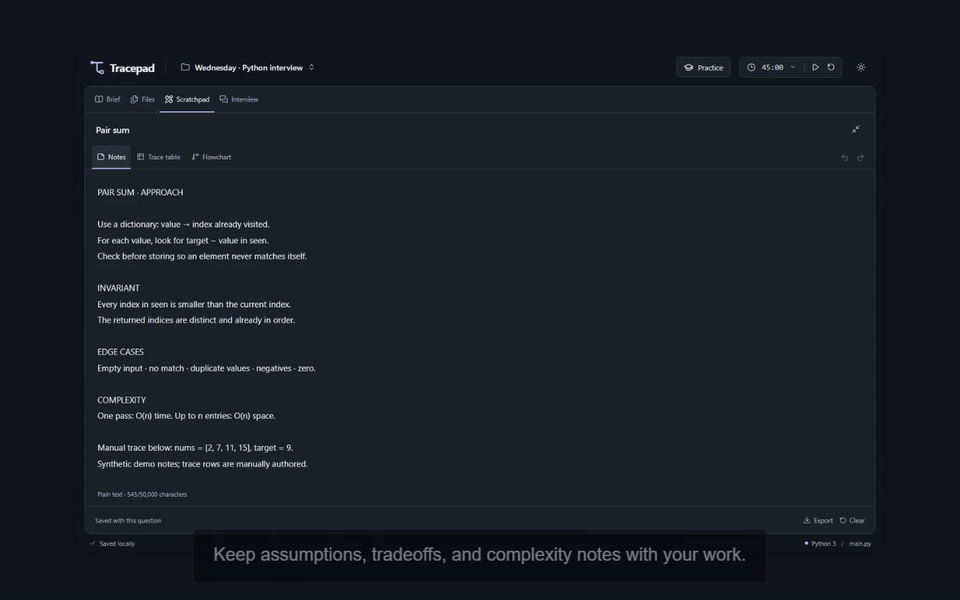](docs/media/features/reasoning-notes.mp4)

[Watch the full clip · 10s](docs/media/features/reasoning-notes.mp4) · [Captions](docs/media/features/reasoning-notes.vtt)

#### Trace tables

Track variable state one step at a time, beside the code. Make the behavior concrete before changing the implementation.

[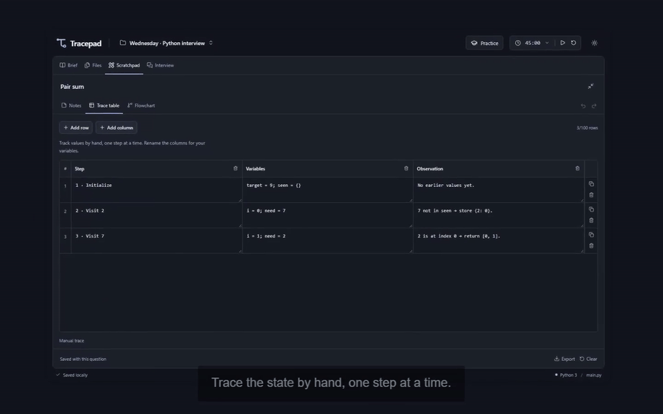](docs/media/features/trace-tables.mp4)

[Watch the full clip · 7s](docs/media/features/trace-tables.mp4) · [Captions](docs/media/features/trace-tables.vtt)

#### Flowcharts

Sketch the approach in an editable diagram. Expand the canvas when a problem needs more room to think.

[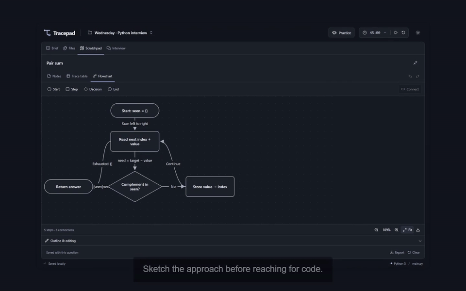](docs/media/features/flowcharts.mp4)

[Watch the full clip · 6s](docs/media/features/flowcharts.mp4) · [Captions](docs/media/features/flowcharts.vtt)

#### Debrief & assistant review

Submit the code, reasoning, and test evidence together. Review where time went and, with a connected assistant, receive feedback grounded in the submitted work.

[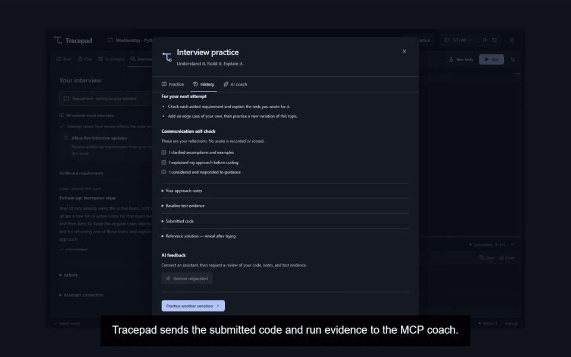](docs/media/features/debrief-review.mp4)

[Watch the full clip · 32s](docs/media/features/debrief-review.mp4) · [Captions](docs/media/features/debrief-review.vtt)

### Python workspace

#### Python modules, runs & tests

Organize a solution into importable Python files. Run the program and inspect named tests for normal inputs and edge cases.

[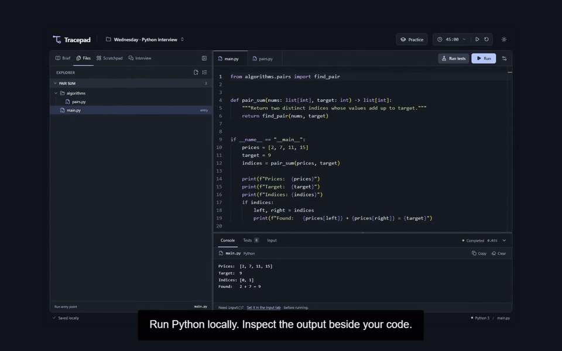](docs/media/features/python-modules.mp4)

[Watch the full clip · 22s](docs/media/features/python-modules.mp4) · [Captions](docs/media/features/python-modules.vtt)

#### Input & the standard library

Supply multiline input before running. Use Python's standard library and read the results in the console.

[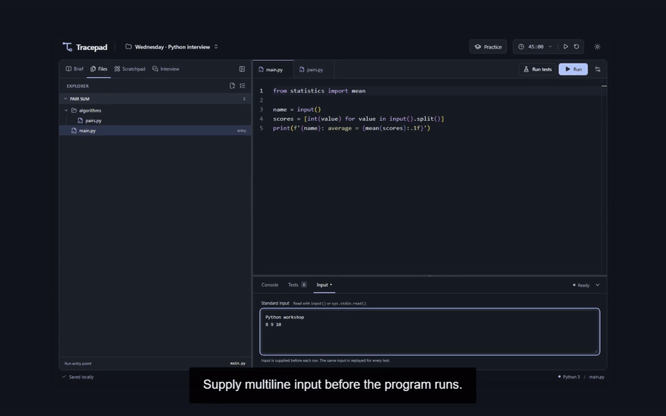](docs/media/features/input-stdlib.mp4)

[Watch the full clip · 13s](docs/media/features/input-stdlib.mp4) · [Captions](docs/media/features/input-stdlib.vtt)

#### Tracebacks & debugging

Inspect a real exception, correct the boundary condition, and rerun. Failed attempts stay useful while you work toward a passing solution.

[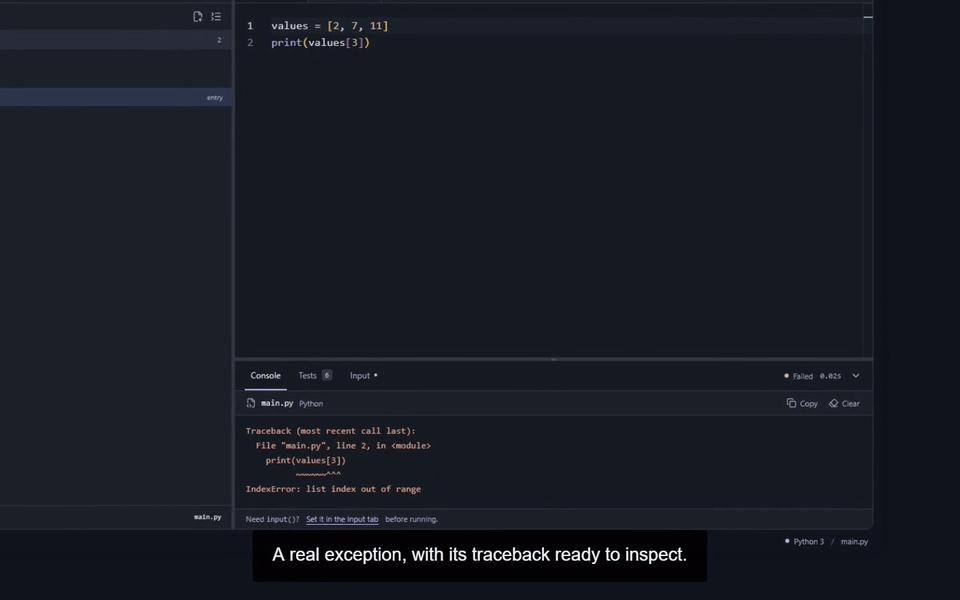](docs/media/features/debugging.mp4)

[Watch the full clip · 14s](docs/media/features/debugging.mp4) · [Captions](docs/media/features/debugging.vtt)

#### Stop & recover

Terminate an infinite loop immediately, then run again in a fresh Python worker without losing your code.

[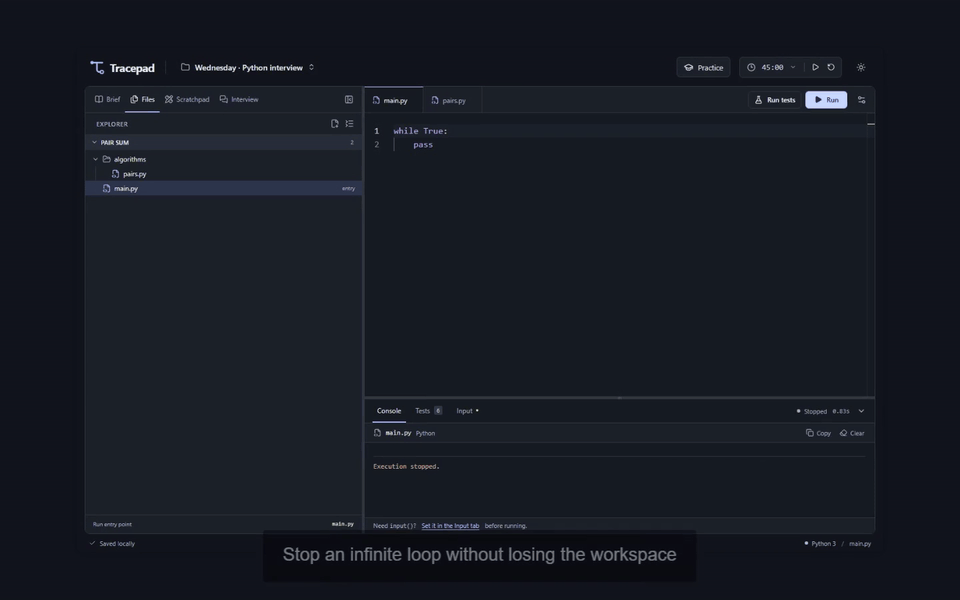](docs/media/features/stop-recover.mp4)

[Watch the full clip · 9s](docs/media/features/stop-recover.mp4) · [Captions](docs/media/features/stop-recover.vtt)

### Optional AI coaching

#### A tailored MCP question

Ask your connected assistant for an exercise on a topic such as OOP. The question arrives with examples and named tests; validate its reference solution before starting.

[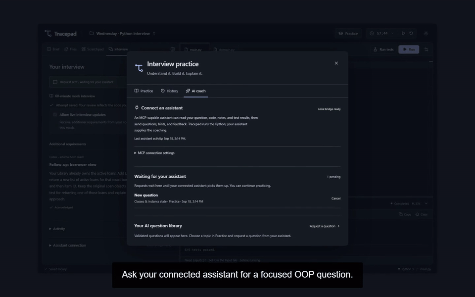](docs/media/features/ai-question.mp4)

[Watch the full clip · 23s](docs/media/features/ai-question.mp4) · [Captions](docs/media/features/ai-question.vtt)

#### A contextual MCP hint

Request help on the attempt in front of you. A connected coach can inspect the code and failing checks, send a targeted hint, and let you work through the fix.

[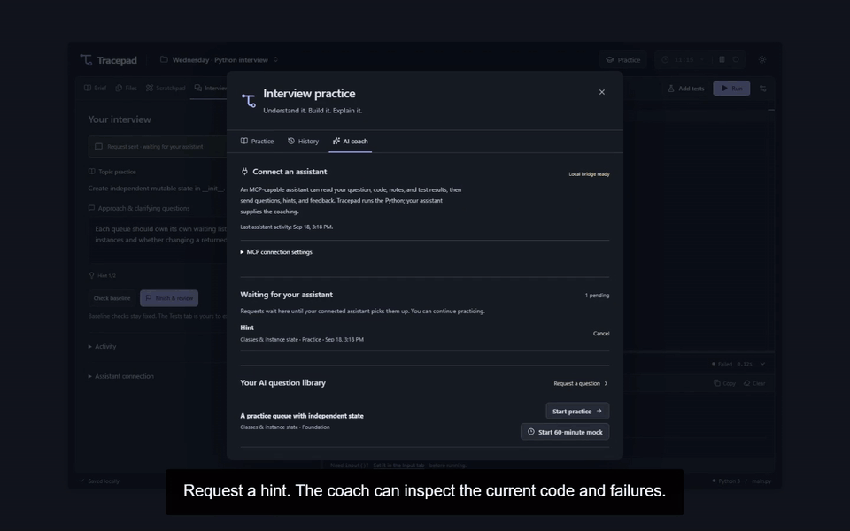](docs/media/features/contextual-hint.mp4)

[Watch the full clip · 35s](docs/media/features/contextual-hint.mp4) · [Captions](docs/media/features/contextual-hint.vtt)

#### Live MCP follow-up

Opt in to live requirements from an external assistant. See the attributed update in the Interview panel, acknowledge it, and test the change.

[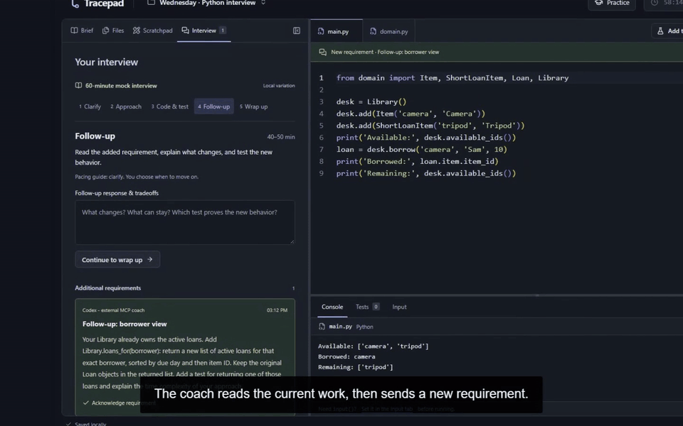](docs/media/features/live-followup.mp4)

[Watch the full clip · 33s](docs/media/features/live-followup.mp4) · [Captions](docs/media/features/live-followup.vtt)

### Projects & saved work

#### Separate interview projects

Keep preparation for different interviews in separate projects, each with its own code, questions, and practice history.

[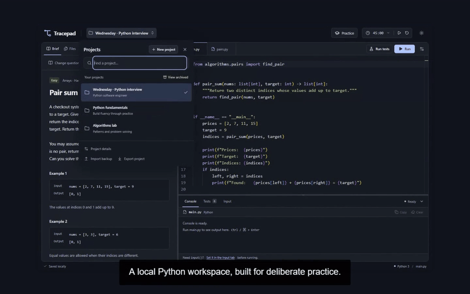](docs/media/features/projects.mp4)

[Watch the full clip · 11s](docs/media/features/projects.mp4) · [Captions](docs/media/features/projects.vtt)

#### Light mode & saved work

Choose a complete light or dark theme. Refresh and resume the saved project with your work and preferences intact.

[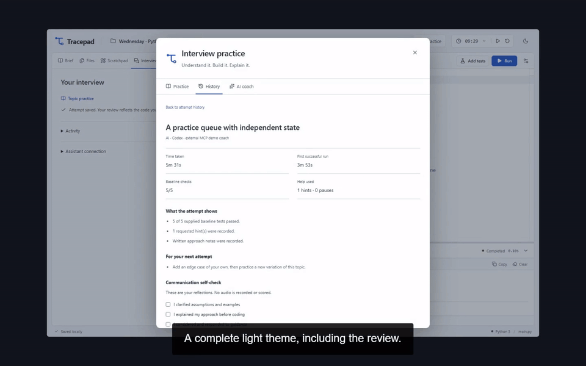](docs/media/features/themes-saving.mp4)

[Watch the full clip · 14s](docs/media/features/themes-saving.mp4) · [Captions](docs/media/features/themes-saving.vtt)

[Compact video index & recording details](docs/DEMO.md) · [Continuous 4:49 walkthrough](docs/media/tracepad-demo.mp4) · [Back to quick start](#start)

## Saving and privacy

Projects save to a local SQLite database at **`.localpad/projects.sqlite`**. Code runs in a disposable Pyodide browser worker; Monaco and Python assets are served locally. The app has no accounts or cloud code-execution service.

Use **Export project** for a complete JSON backup and **Import backup** to restore it as a separate project. Clearing browser data does not erase database saves. Backups contain your code, notes, and feedback, so review them before sharing.

This is a personal practice environment, not a security boundary for hostile Python. Runs have a 10-second execution limit and a 100 KiB output cap. [Storage, recovery, and runtime details](docs/WORKSPACE_GUIDE.md#saving-and-privacy) · [Security policy](SECURITY.md)

## Build and verify

```sh
npm run build
npm run preview
```

The production preview runs at **[127.0.0.1:4173](http://127.0.0.1:4173/)**.

```sh
npx playwright install chromium
npm run check:repo
npm run notices:check
npm test
npm run test:e2e
npm run test:e2e:production
```

Browser tests use isolated servers and databases, including checks against actual Pyodide and offline production loading. Clean-install, browser, and production checks passed on Windows, Linux, and macOS at [`f8c9242`](https://github.com/sidkolapalli/TracePad/actions/runs/35399169691). See [current CI runs](https://github.com/sidkolapalli/TracePad/actions/workflows/ci.yml) for subsequent commits. Browser automation covers pinned Chromium; Safari and Firefox have not been verified.

Built with React, TypeScript, Vite, Monaco, Pyodide, and SQLite. See the [development guide and source map](docs/DEVELOPMENT.md#project-structure).

## Contribute

Useful early contributions include exercise reviews, accessibility fixes, installation testing, and feedback from a complete rehearsal. Start with the [contribution guide](CONTRIBUTING.md), [exercise template](docs/EXERCISE_TEMPLATE.md), or [community roadmap](docs/COMMUNITY_ROADMAP.md).

For help, reproducible bugs, and feature proposals, [open an issue](https://github.com/sidkolapalli/TracePad/issues) with your OS, browser, and steps to reproduce. For security concerns, follow [SECURITY.md](SECURITY.md).

## License

Original source and exercise content are [MIT licensed](LICENSE). Bundled dependencies retain their own licenses; see [third-party notices](THIRD_PARTY_NOTICES.md).
