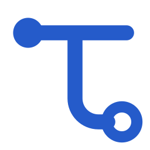
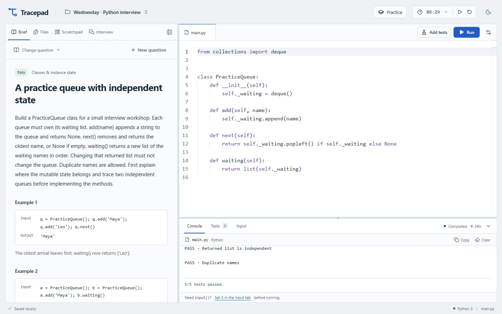
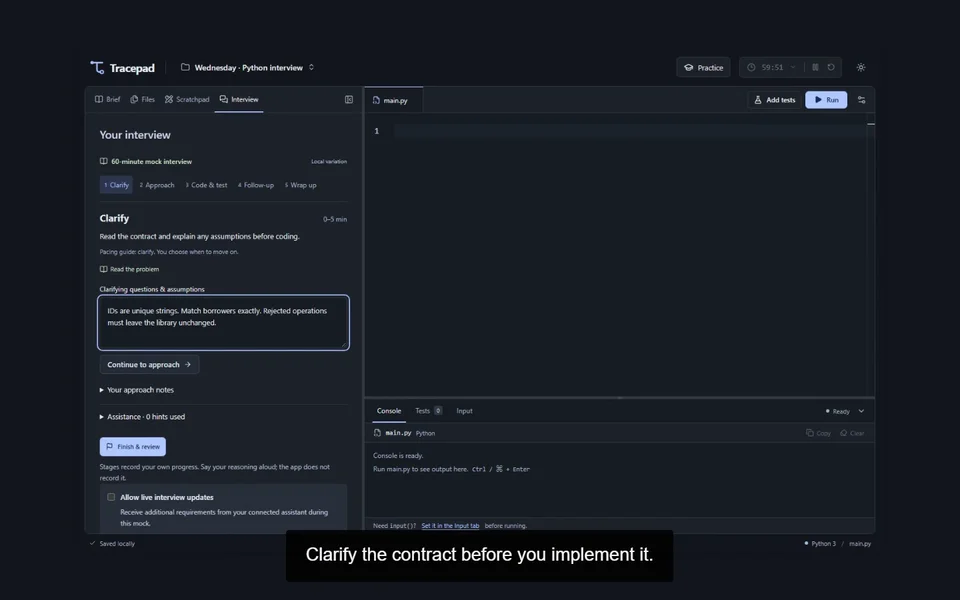
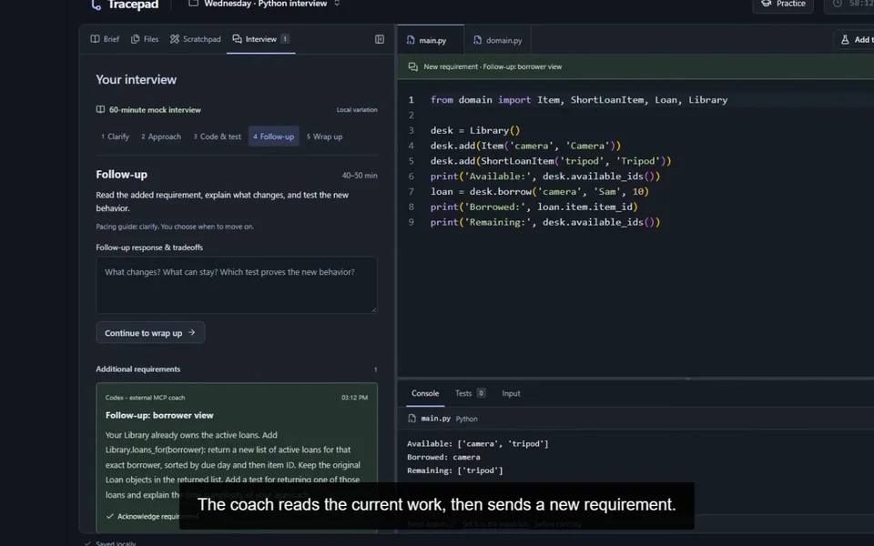

<p align="center">
  <picture>
    <source media="(prefers-color-scheme: dark)" srcset="docs/media/tracepad-mark-dark.svg">
    
  </picture>
</p>

<h1 align="center">Tracepad</h1>

<p align="center"><strong>Understand it. Build it. Explain it.</strong></p>

<p align="center">
  A local Python workspace for learning fundamentals, rehearsing interviews,<br>
  and making your reasoning visible—with AI guidance when you choose.
</p>

<p align="center">
  <a href="#start"><strong>Get started</strong></a> ·
  <a href="docs/DEMO.md#feature-videos">Feature videos</a> ·
  <a href="docs/WORKSPACE_GUIDE.md">User guide</a> ·
  <a href="docs/MCP.md">MCP integration</a> ·
  <a href="CONTRIBUTING.md">Contribute</a>
</p>

<p align="center">
  <a href="docs/ALPHA_CHECKLIST.md">Early alpha · 0.1.0-alpha.1</a> &nbsp; / &nbsp;
  Node.js 24 &nbsp; / &nbsp;
  <a href="LICENSE">MIT licensed</a>
</p>

<a href="docs/DEMO.md#feature-videos">
  <picture>
    <source media="(prefers-color-scheme: dark)" srcset="docs/media/workspace-dark.webp">
    
  </picture>
</a>

<p align="center">
  Your problem, code, and evidence in one workspace.<br>
  <a href="docs/DEMO.md#feature-videos"><strong>Watch a feature in 6–35 seconds</strong></a>
</p>

Tracepad brings the whole practice session together: write Python, trace an idea, test edge cases, respond to a changing brief, and review what happened. Projects stay on your computer. Core practice works offline after installation.

**Early alpha.** The rehearsal flow is implemented; question quality, installation across platforms, and the newcomer experience still need wider testing. See the [verification record and release checklist](docs/ALPHA_CHECKLIST.md).

## Start

You need **Node.js 24**, npm, and a browser. No system Python or separate database installation is required.

```sh
git clone https://github.com/sidkolapalli/TracePad.git
cd TracePad
npm ci
npm run dev
```

Open **[127.0.0.1:5173](http://127.0.0.1:5173/)** and keep the terminal running while you practice. Installation downloads the pinned Python runtime once; subsequent local practice needs no internet connection.

For your first session, open **Practice → 60-minute mock interview**, or choose a shorter topic drill. The [first rehearsal walkthrough](docs/ALPHA_CHECKLIST.md#first-rehearsal-walkthrough) takes you from an empty editor to a saved review.

[Installation notes](docs/DEVELOPMENT.md#installation-notes) · [Production build](#build-and-verify)

## Practice the whole interview

**Clarify → Explain an approach → Code & test → Handle a follow-up → Submit → Review**

A strict mock starts with a blank editor and a 60-minute clock that keeps running across refreshes. Stage prompts help you pace the session. The debrief preserves submitted code, test evidence, reasoning, time spent in each stage, and any assistance used.

| When you want to…                | Tracepad gives you…                                                                                         |
| -------------------------------- | ----------------------------------------------------------------------------------------------------------- |
| Cement the fundamentals          | 15/20-minute topic drills for OOP, collections, and debugging; eight algorithm exercises; custom questions. |
| Build and test a solution        | Monaco, Python modules, named assertion tests, multiline input, tracebacks, and immediate Stop.             |
| Make your reasoning visible      | Notes, manual trace tables, and editable flowcharts beside the code or across the workspace.                |
| Prepare for different interviews | Separate saved projects, independent drafts and history, JSON backups, and light/dark themes.               |
| Rehearse changing requirements   | A scripted local follow-up, or attributed updates from an optional MCP-connected assistant.                 |

[Explore the workspace guide](docs/WORKSPACE_GUIDE.md) for controls, shortcuts, timer behavior, and limits.

## See it in action

Each clip focuses on one feature. Click a preview to watch.

| Timed interview practice                                                                                                                                                                                                          | Optional MCP coaching                                                                                                                                                                                                                                       |
| --------------------------------------------------------------------------------------------------------------------------------------------------------------------------------------------------------------------------------- | ----------------------------------------------------------------------------------------------------------------------------------------------------------------------------------------------------------------------------------------------------------- |
| [](docs/media/features/timed-mock.mp4)<br>**[Start a timed mock · 34s](docs/media/features/timed-mock.mp4)**<br>Clarify the contract and explain an approach. | [](docs/media/features/live-followup.mp4)<br>**[Handle a live follow-up · 33s](docs/media/features/live-followup.mp4)**<br>Receive a requirement, adapt, and test. |

**[Browse all 14 feature videos](docs/DEMO.md#feature-videos)** — including modules, trace tables, flowcharts, debugging, AI questions, contextual hints, and saved reviews. Captions are included.

Recorded with synthetic projects, prepared code, and edited waits. Python execution and MCP exchanges are real; the assistant is external to Tracepad.

## Connect an AI assistant

Practice works on its own. To add coaching, open **Practice → AI coach** and copy the generated MCP configuration into your assistant's settings.

Your assistant can inspect the current work, supply a tailored question, respond to a requested hint, add an opted-in requirement, or review a submission. Supplied reference solutions must pass their baseline tests before a question can start. Updates arrive in the interface with attribution and remain part of the practice evidence.

Tracepad does not include a model or an autonomous interviewer. Offline question variations are labelled separately from AI-generated questions. Connecting an assistant shares the exposed practice context with that assistant; its provider's data handling applies.

[MCP setup and protocol](docs/MCP.md) · [Watch a contextual hint · 35s](docs/media/features/contextual-hint.mp4)

## Saving and privacy

Projects save to a local SQLite database at **`.localpad/projects.sqlite`**. Code runs in a disposable Pyodide browser worker; Monaco and Python assets are served locally. The app has no accounts or cloud code-execution service.

Use **Export project** for a complete JSON backup and **Import backup** to restore it as a separate project. Clearing browser data does not erase database saves. Backups contain your code, notes, and feedback, so review them before sharing.

This is a personal practice environment, not a security boundary for hostile Python. Runs have a 10-second execution limit and a 100 KiB output cap. [Storage, recovery, and runtime details](docs/WORKSPACE_GUIDE.md#saving-and-privacy) · [Security policy](SECURITY.md)

## Build and verify

```sh
npm run build
npm run preview
```

The production preview runs at **[127.0.0.1:4173](http://127.0.0.1:4173/)**.

```sh
npx playwright install chromium
npm run check:repo
npm run notices:check
npm test
npm run test:e2e
npm run test:e2e:production
```

Browser tests use isolated servers and databases, including checks against actual Pyodide and offline production loading. The [CI workflow](.github/workflows/ci.yml) defines Windows, Linux, and macOS jobs; completed platform checks are recorded in the [alpha checklist](docs/ALPHA_CHECKLIST.md).

[Development guide and project structure](docs/DEVELOPMENT.md)

## Contribute

Useful early contributions include exercise reviews, accessibility fixes, installation testing, and feedback from a complete rehearsal. Start with the [contribution guide](CONTRIBUTING.md), [exercise template](docs/EXERCISE_TEMPLATE.md), or [community roadmap](docs/COMMUNITY_ROADMAP.md).

For reproducible bugs and feature proposals, [open an issue](https://github.com/sidkolapalli/TracePad/issues). For security concerns, follow [SECURITY.md](SECURITY.md).

## License

Original source and exercise content are [MIT licensed](LICENSE). Bundled dependencies retain their own licenses; see [third-party notices](THIRD_PARTY_NOTICES.md).
