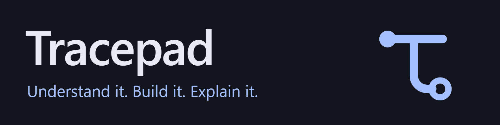
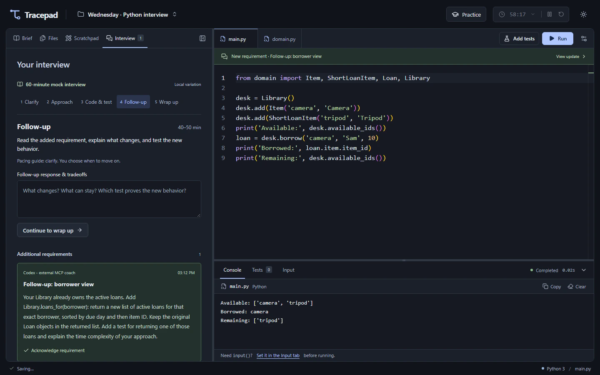

**A local Python workspace for learning, interview rehearsal, and making your reasoning visible.**

Write real Python, work through an idea beside your code, and practice the full interview. Bring an AI coach when you want guidance.

**[Get started](#start)** · [Explore the features](#see-it-in-action) · [User guide](docs/WORKSPACE_GUIDE.md) · [Contribute](#contribute)

[Early alpha · 0.1.0-alpha.1](docs/ALPHA_CHECKLIST.md) · Node.js 24 · [MIT license](LICENSE) · [CI results](https://github.com/sidkolapalli/TracePad/actions/workflows/ci.yml)

[](docs/media/workspace-dark.png)

[View full size](docs/media/workspace-dark.png) · [Light workspace](docs/media/workspace-light.png) · [Watch the walkthrough · 4:49](docs/media/tracepad-demo.mp4)

- **Build an understanding.** Practice Python fundamentals and OOP with focused drills, eight algorithm exercises, or questions you bring yourself.
- **Make the thinking visible.** Keep approach notes, manual trace tables, and editable flowcharts beside your code.
- **Rehearse the whole interview.** Work through a strict mock, respond to a follow-up, and review the code, timing, and help used.

Core practice works offline after installation. Python runs in your browser; projects save to a local SQLite database. AI coaching is optional and requires an external MCP-compatible assistant. This is an early alpha: exercise quality and the newcomer experience need community feedback.

## Start

You need **Node.js 24**, npm, and a browser. No system Python or separate database setup.

```sh
git clone https://github.com/sidkolapalli/TracePad.git
cd TracePad
npm ci
npm run dev
```

Open **[127.0.0.1:5173](http://127.0.0.1:5173/)** and leave the terminal running. Installation downloads the pinned Python runtime and editor assets; they are served locally afterward.

### Your first run

Open **Brief → Change question → Blank sandbox**, enter `print("Hello, Tracepad")` in `main.py`, and select **Run**. **Ctrl+Enter** / **Cmd+Enter** also runs your code. The first run loads the local interpreter, then prints to **Console**.

| Your next session | Where to start |
| --- | --- |
| Practice freely | Blank sandbox, library exercises, or your own question and tests. Timer optional. |
| Focus on a topic | **Practice** → a 15- or 20-minute OOP, collections, or debugging drill using offline templates. |
| Rehearse an interview | **Practice → 60-minute mock interview**. A blank editor and guided stages; no pause or reset. |

[Installation help](docs/DEVELOPMENT.md#installation-notes) · [Keyboard shortcuts & controls](docs/WORKSPACE_GUIDE.md) · [Backups](#saving-and-privacy)

## Find your way around

| I want to… | Read |
| --- | --- |
| Learn the workspace | [User guide](docs/WORKSPACE_GUIDE.md) |
| Connect my own assistant | [AI setup](#connect-an-ai-assistant) · [MCP protocol](docs/MCP.md) |
| Build or test a change | [Development guide](docs/DEVELOPMENT.md) · [Contribution guide](CONTRIBUTING.md) |
| Contribute an exercise | [Exercise template](docs/EXERCISE_TEMPLATE.md) |
| Understand project status | [Roadmap](docs/COMMUNITY_ROADMAP.md) · [Alpha checklist](docs/ALPHA_CHECKLIST.md) |
| Report a problem | [Issues](https://github.com/sidkolapalli/TracePad/issues) · [Security policy](SECURITY.md) |

## See it in action

Four parts of one practice workspace. Every feature has an inline animated preview, a full video, and captions.

**[Interview rehearsal](#interview-rehearsal)** · [Python workspace](#python-workspace) · [AI coaching](#optional-ai-coaching) · [Projects & saved work](#projects--saved-work)

Prefer less motion? Use the [compact video index](docs/DEMO.md). These recordings use synthetic projects, prepared code, and edited waits. Python execution and MCP exchanges are real; the assistant is external. Trace tables and complexity notes are learner-authored.

## Interview rehearsal

**Clarify → Explain an approach → Code & test → Handle a follow-up → Submit → Review**

A mock checks its reference solution before starting the 60-minute clock. Your selected stages, reasoning, tests, and assistance become evidence for the debrief.

<a id="practice-the-whole-interview"></a>

<details>
<summary>How timing and follow-ups work</summary>

The clock continues across refreshes and into overtime. The built-in mock delivers a scripted follow-up; enabling live assistant updates replaces unrevealed scripted requirements. Original baseline scores do not assess those later requirements—add tests for the changed contract.

[Complete rehearsal guide](docs/ALPHA_CHECKLIST.md#first-rehearsal-walkthrough) · [Mock controls & timing](docs/WORKSPACE_GUIDE.md#a-complete-mock-interview)

</details>

### Start a timed mock

A strict 60-minute mock starts with a blank editor and no pause or reset. Clarify the contract, explain an approach, then move into implementation with the clock running.

[](docs/media/features/timed-mock.mp4)

[Play full video · 34s](docs/media/features/timed-mock.mp4) · [Captions](docs/media/features/timed-mock.vtt)

### Reasoning & complexity notes

Keep assumptions, tradeoffs, and your own time and space complexity analysis with the solution. These notes become part of the evidence you can review or share with a coach.

[](docs/media/features/reasoning-notes.mp4)

[Play full video · 10s](docs/media/features/reasoning-notes.mp4) · [Captions](docs/media/features/reasoning-notes.vtt)

### Trace tables

Track variable state one step at a time, beside the code. Make the behavior concrete before changing the implementation.

[](docs/media/features/trace-tables.mp4)

[Play full video · 7s](docs/media/features/trace-tables.mp4) · [Captions](docs/media/features/trace-tables.vtt)

### Flowcharts

Sketch the approach in an editable diagram. Expand the canvas when a problem needs more room to think.

[](docs/media/features/flowcharts.mp4)

[Play full video · 6s](docs/media/features/flowcharts.mp4) · [Captions](docs/media/features/flowcharts.vtt)

### Debrief & assistant review

Submit the code, reasoning, and test evidence together. Review where time went and, with a connected assistant, receive feedback grounded in the submitted work.

[](docs/media/features/debrief-review.mp4)

[Play full video · 32s](docs/media/features/debrief-review.mp4) · [Captions](docs/media/features/debrief-review.vtt)

## Python workspace

**One workspace for code, tests, and the mistakes that teach you something.**

Write importable modules, supply input, inspect failures, and start each run in a fresh Python worker.

### Python modules, runs & tests

Organize a solution into importable Python files. Run the program and inspect named tests for normal inputs and edge cases.

[](docs/media/features/python-modules.mp4)

[Play full video · 22s](docs/media/features/python-modules.mp4) · [Captions](docs/media/features/python-modules.vtt)

### Input & the standard library

Supply multiline input before running. Use Python's standard library and read the results in the console.

[](docs/media/features/input-stdlib.mp4)

[Play full video · 13s](docs/media/features/input-stdlib.mp4) · [Captions](docs/media/features/input-stdlib.vtt)

### Tracebacks & debugging

Inspect a real exception, correct the boundary condition, and rerun. Failed attempts stay useful while you work toward a passing solution.

[](docs/media/features/debugging.mp4)

[Play full video · 14s](docs/media/features/debugging.mp4) · [Captions](docs/media/features/debugging.vtt)

### Stop & recover

Terminate an infinite loop immediately, then run again in a fresh Python worker without losing your code.

[](docs/media/features/stop-recover.mp4)

[Play full video · 9s](docs/media/features/stop-recover.mp4) · [Captions](docs/media/features/stop-recover.vtt)

## Optional AI coaching

**Guidance from your assistant, grounded in the attempt in front of you.**

Questions, hints, and opted-in requirements arrive through MCP with visible attribution. [Connect an assistant](#connect-an-ai-assistant) to use these features.

### A tailored MCP question

Ask your connected assistant for an exercise on a topic such as OOP. The question arrives with examples and named tests; validate its reference solution before starting.

[](docs/media/features/ai-question.mp4)

[Play full video · 23s](docs/media/features/ai-question.mp4) · [Captions](docs/media/features/ai-question.vtt)

### A contextual MCP hint

Request help on the attempt in front of you. A connected coach can inspect the code and failing checks, send a targeted hint, and let you work through the fix.

[](docs/media/features/contextual-hint.mp4)

[Play full video · 35s](docs/media/features/contextual-hint.mp4) · [Captions](docs/media/features/contextual-hint.vtt)

### Live MCP follow-up

Opt in to live requirements from an external assistant. See the attributed update in the Interview panel, acknowledge it, and test the change.

[](docs/media/features/live-followup.mp4)

[Play full video · 33s](docs/media/features/live-followup.mp4) · [Captions](docs/media/features/live-followup.vtt)

## Projects & saved work

**Keep each interview’s preparation together.**

Separate your questions, code, and practice history by project. Export a backup to keep a copy of your work.

### Separate interview projects

Keep preparation for different interviews in separate projects, each with its own code, questions, and practice history.

[](docs/media/features/projects.mp4)

[Play full video · 11s](docs/media/features/projects.mp4) · [Captions](docs/media/features/projects.vtt)

### Light mode & saved work

Choose a complete light or dark theme. Refresh and resume the saved project with your work and preferences intact.

[](docs/media/features/themes-saving.mp4)

[Play full video · 14s](docs/media/features/themes-saving.mp4) · [Captions](docs/media/features/themes-saving.vtt)

[All videos & recording details](docs/DEMO.md) · [Back to quick start](#start)

## Connect an AI assistant

Open **Practice → AI coach** and copy the generated MCP configuration into your assistant's settings. A connected assistant can inspect the current work, supply a tailored question, respond to a requested hint, add an opted-in requirement, and review a submitted attempt. Updates appear with attribution and remain part of the practice evidence.

Supplied reference solutions must pass baseline tests before a question can start. Tracepad does not include a model or an autonomous interviewer; offline question variations are labelled separately. Connecting an assistant shares the exposed practice context with its provider.

[Configure your assistant](docs/MCP.md) · [See a contextual hint](#a-contextual-mcp-hint)

## Saving and privacy

Projects save in **`.localpad/projects.sqlite`**. Use **Export project** for a JSON backup and **Import backup** to restore it as a separate project. Clearing browser data does not erase database saves. Backups include code, notes, and feedback; review them before sharing.

Python runs in a disposable Pyodide browser worker, with a 10-second execution limit and a 100 KiB output cap. Monaco and Python assets are served locally. There are no accounts or cloud code-execution services. The app is a personal practice environment, not a security boundary for hostile Python.

[Storage & recovery details](docs/WORKSPACE_GUIDE.md#saving-and-privacy) · [Security policy](SECURITY.md)

## Build and verify

```sh
npm run build
npm run preview
```

The production preview runs at **[127.0.0.1:4173](http://127.0.0.1:4173/)**. For validation:

```sh
npx playwright install chromium
npm run check:repo
npm run notices:check
npm test
npm run test:e2e
npm run test:e2e:production
```

Browser tests use isolated servers and databases, including actual Pyodide and offline production loading. Windows, Linux, and macOS passed at [`f8c9242`](https://github.com/sidkolapalli/TracePad/actions/runs/35399169691); consult [current CI](https://github.com/sidkolapalli/TracePad/actions/workflows/ci.yml) for later commits. Automation covers pinned Chromium. Safari and Firefox remain unverified.

Built with React, TypeScript, Vite, Monaco, Pyodide, and SQLite. [Architecture & development guide](docs/DEVELOPMENT.md#project-structure).

## Contribute

Help make Python practice more useful: review an exercise, improve accessibility, test a clean installation, or tell us where a rehearsal became confusing.

**Fork the repository, create a branch, and open a pull request.** The maintainer reviews and merges changes; community contributors do not need repository write access. Start with the [contribution guide](CONTRIBUTING.md) and include the checks you actually ran. For exercise changes, use the [exercise template](docs/EXERCISE_TEMPLATE.md).

[Report a bug](https://github.com/sidkolapalli/TracePad/issues) · [Explore the roadmap](docs/COMMUNITY_ROADMAP.md) · [Review the alpha checklist](docs/ALPHA_CHECKLIST.md)

## License

Original source and exercise content are [MIT licensed](LICENSE). Bundled dependencies retain their own licenses; see [third-party notices](THIRD_PARTY_NOTICES.md).

---

**Tracepad** · Understand it. Build it. Explain it.
