# Tracepad feature demos

Choose a feature and watch a short clip. Each thumbnail opens an MP4; every clip has its own caption track. Durations are rounded to the nearest second.

These demos use synthetic projects and real Python execution. Prepared code is pasted and long waits are edited out; the timed mock demonstrates the hour-long format using a short recorded attempt. Assistant exchanges use Tracepad's actual MCP server: an external coach reads the work and responds to explicit requests or opted-in live updates. There is no autonomous AI interviewer in the app.

## Feature videos

| Feature                                                                                                                                                                                                                                                                                                                      | Feature                                                                                                                                                                                                                                                                                                          |
| ---------------------------------------------------------------------------------------------------------------------------------------------------------------------------------------------------------------------------------------------------------------------------------------------------------------------------- | ---------------------------------------------------------------------------------------------------------------------------------------------------------------------------------------------------------------------------------------------------------------------------------------------------------------- |
| [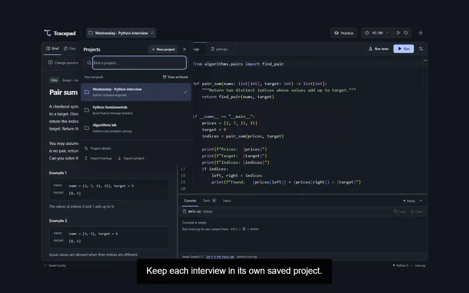](media/features/projects.mp4)<br>**[Separate interview projects · 11s](media/features/projects.mp4)**<br>Switch between saved preparation projects.<br>[Captions](media/features/projects.vtt)                                                           | [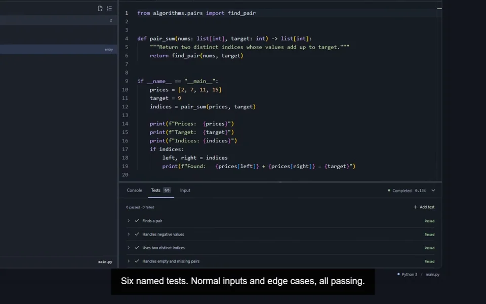](media/features/python-modules.mp4)<br>**[Python modules, runs & tests · 22s](media/features/python-modules.mp4)**<br>Import a module, run Python, and check six named cases.<br>[Captions](media/features/python-modules.vtt)      |
| [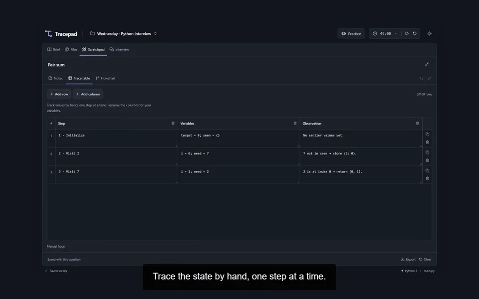](media/features/trace-tables.mp4)<br>**[Trace tables · 7s](media/features/trace-tables.mp4)**<br>Record variable state step by step beside your code.<br>[Captions](media/features/trace-tables.vtt)                                                                | [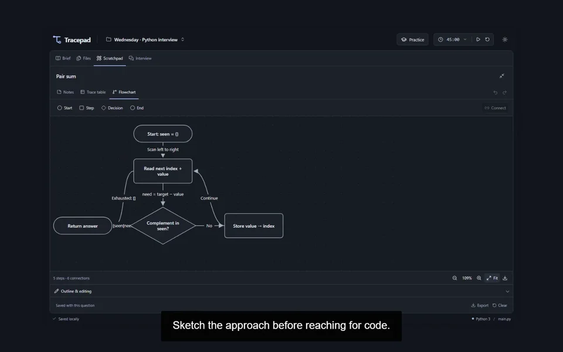](media/features/flowcharts.mp4)<br>**[Flowcharts · 6s](media/features/flowcharts.mp4)**<br>Make the approach visible in an editable diagram.<br>[Captions](media/features/flowcharts.vtt)                                                                   |
| [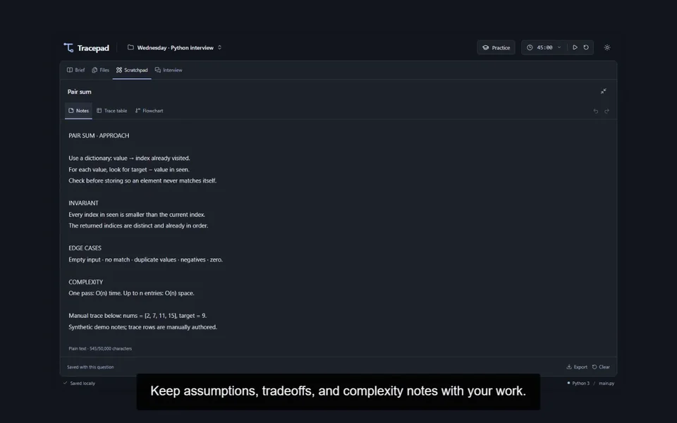](media/features/reasoning-notes.mp4)<br>**[Reasoning & complexity notes · 10s](media/features/reasoning-notes.mp4)**<br>Keep assumptions and your own complexity analysis with the solution.<br>[Captions](media/features/reasoning-notes.vtt) | [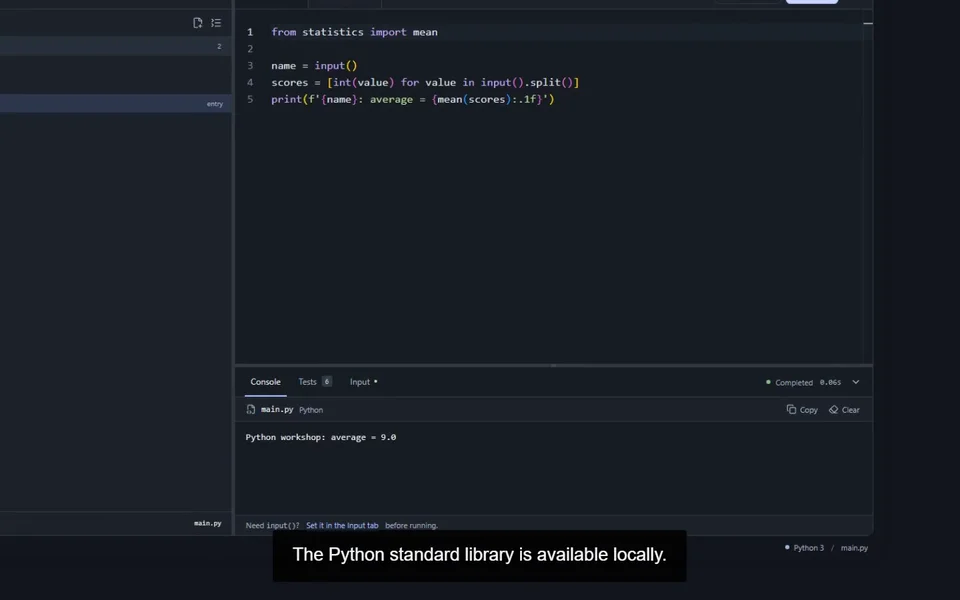](media/features/input-stdlib.mp4)<br>**[Input & the standard library · 13s](media/features/input-stdlib.mp4)**<br>Supply multiline input and inspect a real statistics calculation.<br>[Captions](media/features/input-stdlib.vtt)    |
| [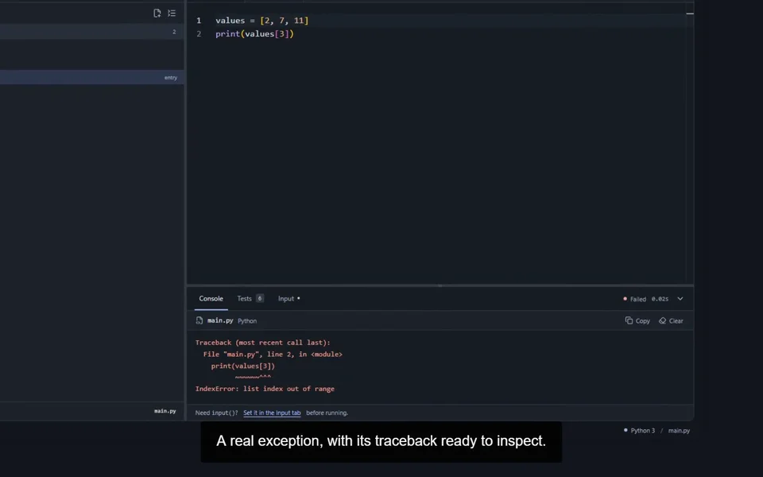](media/features/debugging.mp4)<br>**[Tracebacks & debugging · 14s](media/features/debugging.mp4)**<br>Inspect an exception, correct the boundary, and rerun.<br>[Captions](media/features/debugging.vtt)                                                   | [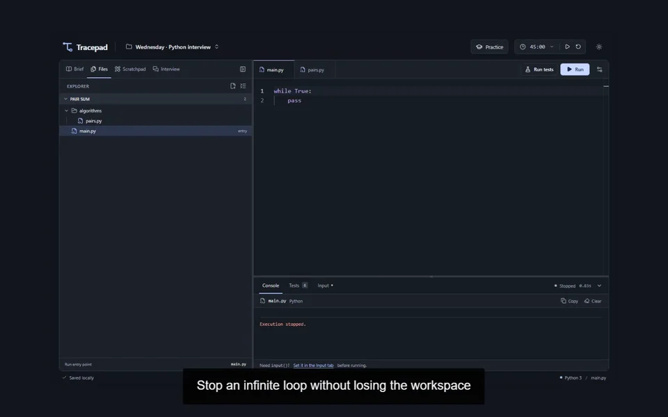](media/features/stop-recover.mp4)<br>**[Stop & recover · 9s](media/features/stop-recover.mp4)**<br>Terminate an infinite loop, then run again in a fresh worker.<br>[Captions](media/features/stop-recover.vtt)                                     |
| [](media/features/timed-mock.mp4)<br>**[Start a timed mock · 34s](media/features/timed-mock.mp4)**<br>Choose a strict mock, clarify the contract, and explain an approach.<br>[Captions](media/features/timed-mock.vtt)                                           | [](media/features/live-followup.mp4)<br>**[Live MCP follow-up · 33s](media/features/live-followup.mp4)**<br>Receive a requirement from an external assistant, acknowledge it, and test the change.<br>[Captions](media/features/live-followup.vtt) |
| [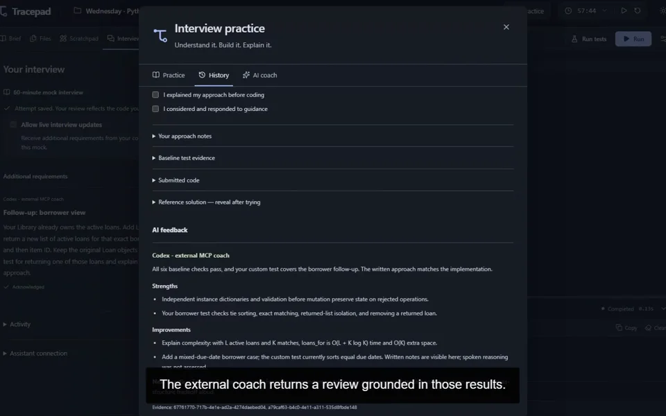](media/features/debrief-review.mp4)<br>**[Debrief & assistant review · 32s](media/features/debrief-review.mp4)**<br>Submit evidence, inspect phase timings, and receive an MCP review.<br>[Captions](media/features/debrief-review.vtt)           | [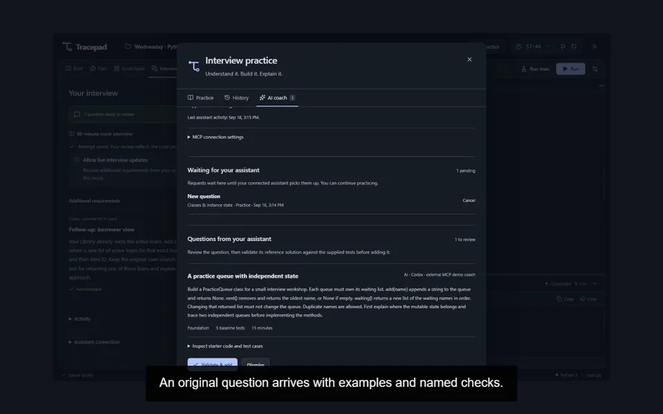](media/features/ai-question.mp4)<br>**[A tailored MCP question · 23s](media/features/ai-question.mp4)**<br>Request an OOP exercise and validate its supplied reference solution.<br>[Captions](media/features/ai-question.vtt)                |
| [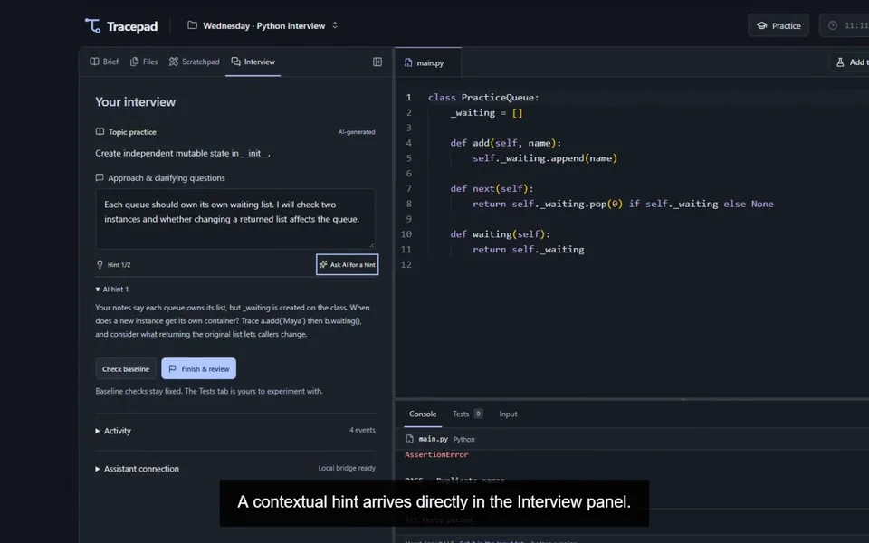](media/features/contextual-hint.mp4)<br>**[A contextual MCP hint · 35s](media/features/contextual-hint.mp4)**<br>Share a failing attempt, receive a targeted hint, and verify the fix.<br>[Captions](media/features/contextual-hint.vtt)                | [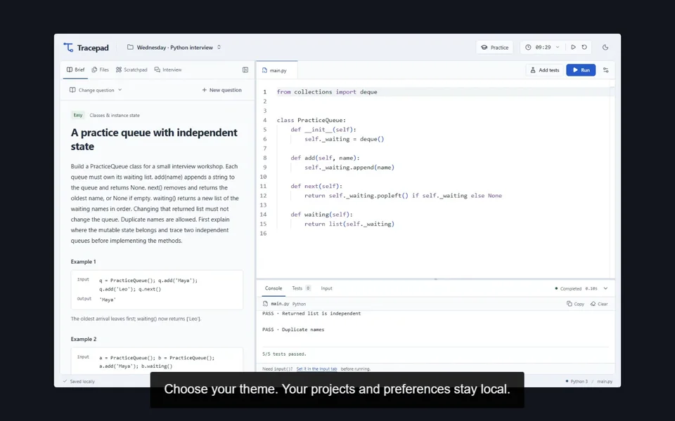](media/features/themes-saving.mp4)<br>**[Light mode & saved work · 14s](media/features/themes-saving.mp4)**<br>Switch themes, refresh, and resume the saved project.<br>[Captions](media/features/themes-saving.vtt)                      |

Prefer a continuous walkthrough? [Watch the original 4:49 product tour](media/tracepad-demo.mp4) · [Full-tour captions](media/tracepad-demo.vtt).

## How it was made

The app is captured in an isolated, headless Chromium session at 1440 × 900. The capture harness checks the demo server's identity before touching its synthetic projects. Normal application storage, the user's browser, desktop, microphone, and camera are not recorded.

[Recordly v1.4.0](https://github.com/webadderallorg/Recordly/releases/tag/v1.4.0) imports the footage and renders the annotated, zoomed MP4. The final file adds Tracepad title cards and is compressed for the README. On-screen labels and a WebVTT track make it usable without audio.

## Recording another walkthrough

Install the app dependencies and the Playwright Chromium browser, then build the production app. Generate a fresh UUID and start an isolated server in one terminal:

```powershell
$env:LOCALPAD_E2E_RUN_ID = '<fresh UUID>'
$env:LOCALPAD_E2E_MODE = 'production'
node scripts/test-server.mjs
```

Use that same UUID in another terminal:

```powershell
$env:LOCALPAD_E2E_RUN_ID = '<same UUID>'
node --import tsx scripts/demo/seed.ts
node scripts/demo/capture.mjs --run-id $env:LOCALPAD_E2E_RUN_ID --coaching
```

The seed refuses existing projects. The capture requires its three synthetic projects and writes raw footage, screenshots, chapter timing, and verification results under ignored `artifacts/demo/`. MCP coaching needs a participating assistant; the capture pauses at requests so responses can be grounded in the current snapshot. `scripts/demo/coach.mjs` provides a guarded local MCP client for that process. It does not generate answers by itself. `scripts/demo/coach-question.json` preserves the original question authored for this recording so the scripted learner can repeat the same checks. Omit `--coaching` for an unattended local rehearsal.

To recreate the feature clips, install `ffmpeg` and `ffprobe` on your PATH and keep the existing full tour at `docs/media/tracepad-demo.mp4`, with its source captions at `docs/media/tracepad-demo.vtt`. From the repository root, run:

```sh
node scripts/demo/split-features.mjs
```

The split uses the titles and cut points in `scripts/demo/features.json` and writes an MP4, WebP thumbnail, and adjusted WebVTT captions for each feature under `docs/media/features/`.

Raw footage, local MCP configuration, databases, and Recordly's downloaded application are not included in the repository. The finished feature clips, thumbnails, captions, and optional full tour are the documentation assets.
